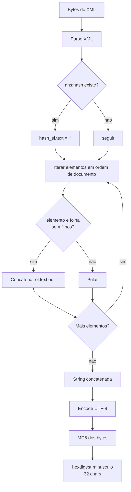

# Especificação canônica: hash MD5 do epílogo TISS/ANS

Documento de **referência**. Define, sem ambiguidade, o algoritmo que toda implementação em qualquer linguagem deve reproduzir byte a byte. Audience: pessoa portando a lib para uma nova linguagem ou validando um port existente.

A implementação de referência executável fica em `conformance/reference.py` (Python + lxml). A suíte de conformidade fica em `conformance/vectors.json` com os arquivos em `conformance/inputs/`. **Em caso de conflito entre este documento e a referência, a referência ganha.** Esta página descreve o que aquela função faz.

## 1. Escopo

O algoritmo calcula o conteúdo do elemento `<ans:hash>` dentro do `<ans:epilogo>` de uma mensagem TISS/ANS (`xmlns:ans="http://www.ans.gov.br/padroes/tiss/schemas"`).

A saída é uma string hexadecimal de 32 caracteres minúsculos.

Fora de escopo: validação contra XSD, assinatura, transmissão, persistência, geração de XML válido. A lib calcula e devolve o hash. Nada mais.

## 2. Entradas e saída

- Entrada: bytes do XML completo, na codificação declarada no `<?xml encoding="..."?>` (na prática `iso-8859-1`, mas qualquer encoding suportado pelo parser XML serve).
- Saída: string ASCII de exatamente 32 caracteres, dígitos hex `0-9a-f`.

Exemplo:
```
adc506a9374e05c8a8525a11a50d37ee
```

## 3. Algoritmo

### 3.1 Passos numerados

1. **Parse** do XML com parser padrão da linguagem. Não exige `remove_blank_text`, não exige normalização de espaços. Resolução de entidades externas DEVE estar desligada (XXE).
2. **Zerar** o conteúdo textual do elemento `<ans:hash>`. Substituir por string vazia. Se o elemento não existir, o algoritmo prossegue como se existisse com texto vazio (não contribui).
3. **Concatenar** o conteúdo textual de cada **elemento-folha** (ver seção 5), em ordem de documento. Sem separador. Sem nomes de tag. Sem atributos. Texto vazio contribui string vazia.
4. **Encodar** a string concatenada em **UTF-8** e calcular o **MD5** dos bytes resultantes.
5. Devolver o **hexdigest** em minúsculo (32 caracteres).

### 3.2 Diagrama do fluxo



### 3.3 Pseudo-código

```
fun hash_tiss(raw_bytes):
    root = xml_parse(raw_bytes)            # parser DOM padrao
    h = root.find("ans:hash")              # primeiro descendente
    if h != null:
        h.text = ""
    buffer = ""
    for el in root.iter_in_document_order():
        if el.children.length == 0:
            buffer += el.text or ""
        # else: nao contribui
    return md5(utf8_encode(buffer)).hexdigest().lower()
```

## 4. Caveat crítica: encoding do MD5 é UTF-8, não ISO-8859-1

O **Componente Organizacional do Padrão TISS** (versão nov/2025, página 53, item 146) diz textualmente:

> "O encoding a ser utilizado será sempre o ISO-8859-1."

**Essa frase é ambígua e foi historicamente mal interpretada.** Ela descreve o encoding do **arquivo XML** (que de fato é declarado ISO-8859-1), **não** o encoding dos bytes que alimentam o MD5.

Na prática, validada contra três goldens reais (ver seção 8), os valores extraídos do XML são reencodados em **UTF-8** antes do MD5. Implementações que aplicam MD5 sobre bytes ISO-8859-1 produzem um hash diferente e **errado**.

Evidência concreta no histórico:
- `real_envio1.xml` carrega gravado no próprio arquivo o hash `7ad52ac957c7ec78e8531ab2e670c4f4` (MD5 ISO-8859-1, errado).
- O hash correto, aceito pela ANS, é `adc506a9374e05c8a8525a11a50d37ee` (MD5 UTF-8).

**Toda implementação deve usar UTF-8 no passo 4. Sem exceção.**

## 5. Definição de elemento-folha

Um **elemento-folha** é um nó-elemento XML que não contém nenhum nó-elemento filho. Comentários, instruções de processamento e nós de texto não contam como filhos para essa decisão.

Equivalências práticas por API de parser:

| Parser           | Teste de folha                                |
|------------------|-----------------------------------------------|
| lxml (Python)    | `len(el) == 0`                                |
| ElementTree      | `len(list(el)) == 0`                          |
| DOM (genérico)   | `el.childElementCount == 0`                   |
| libxml2 (C)      | `xmlFirstElementChild(el) == NULL`            |
| Rust quick-xml   | rastrear profundidade entre `Start`/`End`     |
| SAX              | folha = `endElement` que não teve `startElement` filho após o próprio `startElement` |

Observações:
- TISS não usa conteúdo misto. Um elemento que tem filhos terá apenas espaços/quebras de linha em `.text` e `.tail`, contribuindo zero. Por isso pular não-folhas é seguro.
- Self-closing (`<x/>`) e vazio (`<x></x>`) são folhas com texto `""`. Ambos contribuem string vazia. São indistinguíveis para o algoritmo.

## 6. Tratamento explícito de casos XML

| Construção         | Tratamento                                                                 |
|--------------------|----------------------------------------------------------------------------|
| Atributos          | **Ignorados.** Não entram no hash. Inclusive `xmlns:*`.                    |
| Namespaces         | Irrelevantes para o cálculo. Apenas o conteúdo de texto importa. O lookup do `<ans:hash>` usa o namespace `http://www.ans.gov.br/padroes/tiss/schemas`. |
| Comentários `<!---->` | Ignorados. Não são elementos.                                           |
| Processing instructions `<?...?>` | Ignoradas.                                                  |
| CDATA              | Tratado como texto. O parser entrega o conteúdo já desembrulhado em `.text`. |
| Entidades padrão (`&amp;` etc.) | Resolvidas pelo parser. O `.text` traz `&` literal.          |
| Entidades externas | DEVEM ser desligadas (XXE). A referência usa `resolve_entities=False`.     |
| BOM (`EF BB BF`)   | Ignorado pelo parser. Não chega no `.text`.                                |
| CR/LF dentro de texto | Preservados literalmente. O vetor `syn_crlf_value.xml` cobre.           |
| Espaços/identação entre tags | Ficam em `.text`/`.tail` de não-folhas e são pulados.            |

## 7. Pré-requisito de localização do `<ans:hash>`

O algoritmo procura **o primeiro** elemento `<ans:hash>` em qualquer profundidade da árvore. No TISS canônico ele fica em `/ans:mensagemTISS/ans:epilogo/ans:hash`, mas a busca não impõe esse caminho (alguns ports de teste usam estruturas reduzidas).

Se houver múltiplos `<ans:hash>` no documento (não conforme), apenas o primeiro é zerado. Os demais contribuem com seu texto original. Esse caso não tem vetor de conformidade e é considerado entrada inválida.

## 8. Vetores de conformidade

Suíte oficial em `conformance/vectors.json` + `conformance/inputs/`. Todo port deve passar nos 8 vetores byte a byte.

| ID                   | Hash esperado                          | Fonte     | Cobre                                    |
|----------------------|----------------------------------------|-----------|------------------------------------------|
| `real_envio1.xml`    | `adc506a9374e05c8a8525a11a50d37ee`     | real      | golden ANS validado                      |
| `real_envio2.xml`    | `df52c4a644b5fde5f9a704545f3f471b`     | real      | golden ANS validado, lote grande         |
| `real_envio3.xml`    | `6f3349379b9c090c33b929de9290dda4`     | real      | golden ANS validado, lote grande         |
| `syn_minimal.xml`    | `3aa0c578c95cdb861a125f480a8a4de5`     | derivado  | cabeçalho + epílogo, zeragem de `<hash>` com lixo |
| `syn_acento.xml`     | `a20afc9a89aadaa2179d03d225337662`     | derivado  | acentuação latina, prova encoding UTF-8  |
| `syn_empty.xml`      | `e43622c19cad903e2abd678330b9d7ca`     | derivado  | `<x></x>` e `<y/>` contribuem `""`       |
| `syn_crlf_value.xml` | `4df6fcedd9ed44aa9741d70e10f06746`     | derivado  | CR/LF dentro de valor preservados        |
| `syn_multi_guia.xml` | `0e1339fa27441b62c28e38267f10632d`     | derivado  | ordem de documento entre guias           |

`source = real`: arquivo XML original transmitido à ANS, com hash confirmado manualmente. **Autoridade absoluta.**
`source = derived`: XML sintético construído para cobrir um caso de borda; hash calculado pela referência e congelado no manifesto.

Regerar a suíte:
```bash
cd conformance
python3 build_fixture.py
```

Validar um port:
```bash
# pseudo-comando, depende do runner do port
port-runner --vectors conformance/vectors.json --inputs conformance/inputs
```

## 9. Histórico e justificativa

O algoritmo foi **reverse-engineered** a partir de três XMLs reais transmitidos pela operadora **Gama Saúde** (extinta em 2026). A documentação oficial do TISS é ambígua quanto ao encoding (ver seção 4) e o código legado interno do TISSGama aplicava ISO-8859-1, produzindo hashes que a ANS rejeitava.

Linha do tempo resumida:
- Manual TISS / Componente Organizacional descreve "encoding ISO-8859-1" sem desambiguar arquivo vs hash.
- TISSGama (legado, arquivado) implementa MD5 sobre bytes ISO-8859-1. Hash gravado nos arquivos enviados não bate com o hash que a ANS aceita.
- Recuperação dos três XMLs envio1/envio2/envio3 com seus hashes corretos (aceitos pela ANS) permite construir oráculo.
- Validação por bisseção: leaf-concat + UTF-8 reproduz os três goldens. Toda outra combinação falha.
- Cinco vetores sintéticos adicionados para travar casos de borda (vazio, acento, CR/LF, multi-guia, mínimo).
- Projeto Gama Saúde encerrado. Algoritmo extraído para `lib_hash_ans` como base canônica de ports multi-linguagem.

A operadora cliente original não existe mais. O algoritmo permanece porque o padrão TISS continua sendo usado por toda a saúde suplementar brasileira e qualquer fornecedor terá o mesmo problema de encoding até a ANS corrigir o texto do manual.

## 10. Versionamento

| Versão | Data       | Mudança                                              |
|--------|------------|------------------------------------------------------|
| 1.0.0  | 2026-05-27 | Spec inicial baseada na referência Python + 8 vetores. |

Mudanças que alterem hash de qualquer vetor existente são **breaking** e exigem bump major + ADR.

## 11. Ver também

- `conformance/reference.py`: implementação canônica executável.
- `conformance/vectors.json`: manifesto da suíte de conformidade.
- `docs/PORTING_GUIDE.md`: guia para implementar em nova linguagem.
- `README.md`: visão geral do projeto.
