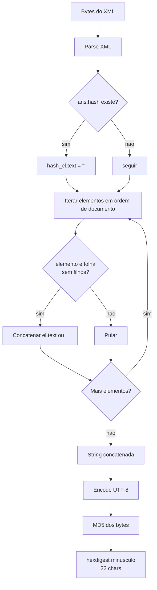

# Especificação canônica: hash MD5 do epílogo TISS/ANS

Documento de **referência**. Define, sem ambiguidade, o algoritmo que toda implementação em qualquer linguagem deve reproduzir byte a byte. Audience: pessoa portando a lib para uma nova linguagem ou validando um port existente.

A implementação de referência executável fica em `conformance/reference.py` (Python + lxml). A suíte de conformidade fica em `conformance/vectors.json` com os arquivos em `conformance/inputs/`. **Em caso de conflito entre este documento e a referência, a referência ganha.** Esta página descreve o que aquela função faz.

## 1. Escopo

O algoritmo calcula o conteúdo do elemento `<ans:hash>` dentro do `<ans:epilogo>` de uma mensagem TISS/ANS (`xmlns:ans="http://www.ans.gov.br/padroes/tiss/schemas"`).

A saída é uma string hexadecimal de 32 caracteres minúsculos.

Fora de escopo: validação contra XSD, assinatura, transmissão, persistência, geração de XML válido. A lib calcula e devolve o hash. Nada mais.

## 2. Entradas e saída

- Entrada: bytes do XML completo, na codificação declarada no `<?xml encoding="..."?>`. **Escopo de encoding: ISO-8859-1 (na prática) e UTF-8.** UTF-16/UTF-32 estão fora de escopo e devem ser **rejeitados** (ver §7 e AMBIGUITY_NOTES §11b).
- Saída: string ASCII de exatamente 32 caracteres, dígitos hex `0-9a-f`. Entrada inválida (ver §7) **não** produz hash: o port deve sinalizar erro.

Exemplo (saída do vetor sintético `syn_minimal.xml`):
```
3aa0c578c95cdb861a125f480a8a4de5
```

## 3. Algoritmo

### 3.1 Passos numerados

1. **Parse** do XML com parser padrão da linguagem. Não exige `remove_blank_text`, não exige normalização de espaços. Resolução de entidades externas DEVE estar desligada (XXE).
2. **Zerar** o conteúdo textual do elemento `<ans:hash>`. Substituir por string vazia. Se o elemento não existir, o algoritmo prossegue como se existisse com texto vazio (não contribui).
3. **Concatenar** o conteúdo textual de cada **elemento-folha** (ver seção 5), em ordem de documento. Sem separador. Sem nomes de tag. Sem atributos. Texto vazio contribui string vazia.
4. **Encodar** a string concatenada em **UTF-8** e calcular o **MD5** dos bytes resultantes.
5. Devolver o **hexdigest** em minúsculo (32 caracteres).

### 3.2 Diagrama do fluxo



### 3.3 Pseudo-código

```
fun hash_tiss(raw_bytes):
    root = xml_parse(raw_bytes)            # parser DOM padrao
    h = root.find("ans:hash")              # primeiro descendente
    if h != null:
        h.text = ""
    buffer = ""
    for el in root.iter_in_document_order():
        if el.children.length == 0:
            buffer += el.text or ""
        # else: nao contribui
    return md5(utf8_encode(buffer)).hexdigest().lower()
```

## 4. Caveat crítica: encoding do MD5 é UTF-8, não ISO-8859-1

O **Componente Organizacional do Padrão TISS** (versão nov/2025, página 53, item 146) diz textualmente:

> "O encoding a ser utilizado será sempre o ISO-8859-1."

**Essa frase é ambígua e foi historicamente mal interpretada.** Ela descreve o encoding do **arquivo XML** (que de fato é declarado ISO-8859-1), **não** o encoding dos bytes que alimentam o MD5.

Na prática, validada de forma privada pelo mantenedor contra três XMLs reais transmitidos à ANS (ver seção 8), os valores extraídos do XML são reencodados em **UTF-8** antes do MD5. Implementações que aplicam MD5 sobre bytes ISO-8859-1 produzem um hash diferente e **errado**.

Evidência concreta no histórico:
- O código legado (TISSGama, arquivado) gravava no arquivo enviado um hash calculado sobre bytes ISO-8859-1. A ANS rejeitava esse hash.
- O hash aceito pela ANS para os mesmos arquivos só é reproduzido quando o MD5 é calculado sobre os bytes **UTF-8** da string concatenada.

**Toda implementação deve usar UTF-8 no passo 4. Sem exceção.**

## 5. Definição de elemento-folha

Um **elemento-folha** é um nó-elemento XML que não contém nenhum nó-elemento filho. Comentários, instruções de processamento e nós de texto não contam como filhos para essa decisão.

Equivalências práticas por API de parser:

| Parser           | Teste de folha                                |
|------------------|-----------------------------------------------|
| lxml (Python)    | `len(el) == 0`                                |
| ElementTree      | `len(list(el)) == 0`                          |
| DOM (genérico)   | `el.childElementCount == 0`                   |
| libxml2 (C)      | `xmlFirstElementChild(el) == NULL`            |
| Rust quick-xml   | rastrear profundidade entre `Start`/`End`     |
| SAX              | folha = `endElement` que não teve `startElement` filho após o próprio `startElement` |

Observações:
- TISS não usa conteúdo misto. Um elemento que tem filhos terá apenas espaços/quebras de linha em `.text` e `.tail`, contribuindo zero. Por isso pular não-folhas é seguro.
- Self-closing (`<x/>`) e vazio (`<x></x>`) são folhas com texto `""`. Ambos contribuem string vazia. São indistinguíveis para o algoritmo.

## 6. Tratamento explícito de casos XML

| Construção         | Tratamento                                                                 |
|--------------------|----------------------------------------------------------------------------|
| Atributos          | **Ignorados.** Não entram no hash. Inclusive `xmlns:*`.                    |
| Namespaces         | Irrelevantes para o cálculo. Apenas o conteúdo de texto importa. O lookup do `<ans:hash>` usa o namespace `http://www.ans.gov.br/padroes/tiss/schemas`. |
| Comentários `<!---->` | Ignorados. Não são elementos.                                           |
| Processing instructions `<?...?>` | Ignoradas.                                                  |
| CDATA              | Tratado como texto. O parser entrega o conteúdo já desembrulhado em `.text`. |
| Entidades padrão (`&amp;` etc.) | Resolvidas pelo parser. O `.text` traz `&` literal.          |
| Entidades externas | DEVEM ser desligadas (XXE). A referência usa `resolve_entities=False`.     |
| BOM (`EF BB BF`)   | Ignorado pelo parser. Não chega no `.text`.                                |
| CR/LF dentro de texto | Preservados literalmente. O vetor `syn_crlf_value.xml` cobre.           |
| Espaços/identação entre tags | Ficam em `.text`/`.tail` de não-folhas e são pulados.            |

## 7. Pré-requisito de localização do `<ans:hash>`

O algoritmo localiza o elemento `<ans:hash>` (pela URI do namespace TISS + nome local `hash`, **não** pelo prefixo literal). No TISS canônico ele fica em `/ans:mensagemTISS/ans:epilogo/ans:hash`, mas a busca não impõe esse caminho (alguns ports de teste usam estruturas reduzidas).

**Casos fixados (rejeição):**
- **Múltiplos `<ans:hash>`** (não conforme; TISS prevê exatamente um) → **rejeitar** (erro). Não tentar adivinhar qual zerar. Vetor negativo `syn_multi_hash.xml`.
- **Encoding fora de escopo** (UTF-16/UTF-32, detectado por BOM) → **rejeitar** (erro). Vetor negativo `syn_utf16.xml`.
- **Ausência de `<ans:hash>`** é válida: o documento é concatenado normalmente, sem zeragem. Vetor `syn_sem_hash.xml`.

## 8. Vetores de conformidade

Suíte oficial em `conformance/vectors.json` + `conformance/inputs/`. **18 vetores positivos** (comparam hash byte a byte) + **2 vetores negativos** (entrada que o port deve rejeitar). Campo `expect` no manifesto: ausente/`"hash"` = positivo; `"error"` = negativo.

**O conjunto público de conformidade é 100% sintético** (`source = derived`). Nenhum XML real de paciente e nenhum hash derivado de XML real é distribuído no repositório, por LGPD. Os três XMLs reais usados para descobrir e validar o algoritmo vivem em diretório privado do mantenedor, fora do repo, e nunca entram no manifesto público (ver `conformance/build_fixture.py`, variável `TISS_PRIVATE_XMLS`).

A tabela abaixo é gerada a partir de `conformance/vectors.json` (fonte de verdade):

| ID                          | Hash esperado                          | Fonte     | Cobre                                              |
|-----------------------------|----------------------------------------|-----------|----------------------------------------------------|
| `syn_minimal.xml`           | `3aa0c578c95cdb861a125f480a8a4de5`     | derivado  | mínimo: cabeçalho + epílogo, poucos valores        |
| `syn_acento.xml`            | `a20afc9a89aadaa2179d03d225337662`     | derivado  | acentuação latina, prova encoding UTF-8            |
| `syn_empty.xml`             | `e43622c19cad903e2abd678330b9d7ca`     | derivado  | `<x></x>` e `<y/>` contribuem `""`                 |
| `syn_crlf_value.xml`        | `4df6fcedd9ed44aa9741d70e10f06746`     | derivado  | CR/LF dentro de valor preservados                  |
| `syn_multi_guia.xml`        | `0e1339fa27441b62c28e38267f10632d`     | derivado  | ordem de documento entre múltiplas guias           |
| `syn_entidades_xml.xml`     | `b0d587961802b967dd4e6033dc659625`     | derivado  | entidades XML predefinidas decodificadas pelo parser |
| `syn_cdata.xml`             | `9fe56c6419fc78dd26313d63834b877f`     | derivado  | CDATA entregue como texto literal                  |
| `syn_comentario.xml`        | `2c934218fab50edb83f9c8902f30cdfd`     | derivado  | comentário XML entra no concat (ver AMBIGUITY_NOTES) |
| `syn_atributo_folha.xml`    | `7a811223bea501d2b307c9181de25fb3`     | derivado  | atributos de folha não entram no concat            |
| `syn_namespace_xsi.xml`     | `7691354564876cbd1f105bf85cb9abd0`     | derivado  | namespace alternativo em atributo ignorado         |
| `syn_whitespace_puro.xml`   | `4b09417e46d92615764c81b434e3dd58`     | derivado  | valor só com espaços preservado literalmente       |
| `syn_leading_zero.xml`      | `a258e0ce23d683450961493351fa21b8`     | derivado  | zeros à esquerda não normalizados (`00123`)        |
| `syn_iso8859_simbolos.xml`  | `f17145d66f22e7641a4ea466e4b8024b`     | derivado  | símbolos ISO-8859-1 puros (grau, parágrafo, etc.)  |
| `syn_perf_grande.xml`       | `4ea0da5e9916827df848a3fcf661d3d7`     | derivado  | performance: documento grande, muitas guias        |
| `syn_bom_utf8.xml`          | `47d20fe3f5bb21cba74e54e5292170ab`     | derivado  | BOM UTF-8 aceito pela referência                   |
| `syn_default_ns.xml`        | `3ad92bd5ebbf35364433b897d08bf23a`     | derivado  | namespace TISS default (`xmlns=` sem prefixo `ans:`) |
| `syn_sem_hash.xml`          | `710a997000c9780901be02fafe449c64`     | derivado  | documento sem `<ans:hash>`: concatena tudo, sem erro |
| `syn_entidade_numerica.xml` | `aefea736f666cc84a68da21ff699dadc`     | derivado  | entidades de caractere numéricas (`&#xE9;`/`&#231;`) |

### 8.1 Vetores negativos (rejeição)

Entrada que **não** produz hash; o port deve sinalizar erro. No manifesto têm `expect: "error"` e `expected_md5: null`.

| ID                     | Cobre                                                       |
|------------------------|-------------------------------------------------------------|
| `syn_multi_hash.xml`   | múltiplos `<ans:hash>` → rejeitar (ver §7, AMBIGUITY §9)     |
| `syn_utf16.xml`        | encoding UTF-16 (BOM) → rejeitar (ver §7, AMBIGUITY §11b)    |

`source = derived`: XML sintético construído para cobrir um caso de borda; hash calculado pela referência e congelado no manifesto. Os hashes acima são reproduzidos por todos os 9 ports atuais.

Regerar a suíte:
```bash
cd conformance
python3 build_fixture.py
```

Validar um port:
```bash
# pseudo-comando, depende do runner do port
port-runner --vectors conformance/vectors.json --inputs conformance/inputs
```

## 9. Histórico e justificativa

O algoritmo foi **reverse-engineered** a partir de três XMLs reais com hashes confirmados pela ANS, em um contexto de uso descontinuado. A documentação oficial do TISS é ambígua quanto ao encoding (ver seção 4) e o código legado interno (TISSGama, hoje arquivado) aplicava ISO-8859-1, produzindo hashes que a ANS rejeitava.

Linha do tempo resumida:
- Manual TISS / Componente Organizacional descreve "encoding ISO-8859-1" sem desambiguar arquivo vs hash.
- TISSGama (legado, arquivado) implementa MD5 sobre bytes ISO-8859-1. Hash gravado nos arquivos enviados não bate com o hash que a ANS aceita.
- Recuperação de três XMLs reais com seus hashes corretos (aceitos pela ANS) permite construir oráculo. Esses arquivos contêm PII e ficam em diretório privado fora do repo.
- Validação por bisseção: leaf-concat + UTF-8 reproduz os três goldens privados. Toda outra combinação falha.
- Quinze vetores sintéticos foram construídos para travar casos de borda (mínimo, acento, vazio, CR/LF, multi-guia, entidades, CDATA, comentário, atributo, namespace, whitespace puro, zero à esquerda, símbolos ISO, performance e BOM) sem distribuir qualquer dado real.
- Contexto de uso original descontinuado. Algoritmo extraído para `lib_hash_ans` como base canônica de ports multi-linguagem.

O contexto cliente original não existe mais. O algoritmo permanece porque o padrão TISS continua sendo usado por toda a saúde suplementar brasileira e qualquer fornecedor terá o mesmo problema de encoding até a ANS corrigir o texto do manual.

## 10. Versionamento

| Versão | Data       | Mudança                                              |
|--------|------------|------------------------------------------------------|
| 1.0.0  | 2026-05-28 | Spec baseada na referência Python + 15 vetores de conformidade 100% sintéticos. |
| 1.1.0  | 2026-05-28 | Suíte expandida p/ 20 vetores (18 positivos + 2 negativos). Fixado: rejeição de múltiplos `<ans:hash>` e de encoding UTF-16/UTF-32. |

Mudanças que alterem hash de qualquer vetor existente são **breaking** e exigem bump major + ADR.

## 11. Ver também

- `conformance/reference.py`: implementação canônica executável.
- `conformance/vectors.json`: manifesto da suíte de conformidade.
- `docs/PORTING_GUIDE.md`: guia para implementar em nova linguagem.
- `README.md`: visão geral do projeto.
